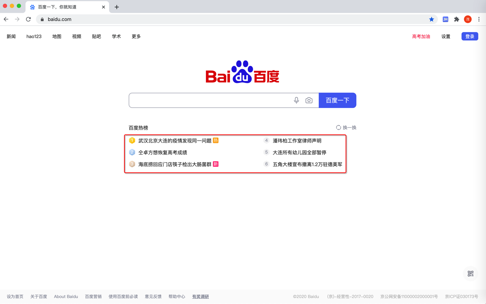

# 抓取百度热榜

具体详见：

* 【记录】演示如何实现简单爬虫：用Python提取百度首页中百度热榜内容列表
* 【已解决】用Python代码获取到百度首页源码并提取保存百度热榜内容列表
* 【已解决】Mac中用Chrome开发者工具分析百度首页的百度热榜内容加载逻辑
* 【已解决】用Python爬虫框架PySpider实现爬虫爬取百度热榜内容列表

## 目标

爬取百度首页

百度一下，你就知道

https://www.baidu.com/

中的 百度热榜的内容的标题的列表：

希望输出的内容：

一个字符串列表：

* 武汉北京大连的疫情发现同一问题
* ...
* 五角大楼宣布撤离1.2万驻德美军

保存格式，暂定为csv文件。

## 先了解基础逻辑

入手之前，先要了解清楚：

* 写爬虫的思路
    * 先去（用工具）分析流程
        * 此处：用Chrome中 开发者工具 去分析
            * 用Chrome的开发者工具分析百度首页的内容加载的流程
    * 再去用代码实现逻辑
        * 此处：用Python代码实现
        * 要做的事情可以分成3个步骤
            * Download=下载：html网页源码
                * 期间可能涉及
                    * 多次利用Chrome的开发者工具去调试页面内容加载逻辑
            * Parse=分析：分析html中源码中我们要的内容的提取规则是什么
                * 需要事先
                    * 分析要抓取的内容，所对应的规则
                        * 然后用代码实现规则，提取内容
            * Save=保存：把抓取到的内容保存出来
