# 用Chrome分析逻辑

此处去用`Chrome`的 **开发者工具** 去分析百度首页中加载出百度热榜中的内容的基本逻辑。

先去`Mac`中打开`Chrome`中的 `开发者工具`=`Developer Tools`：

直接用快捷键（Mac中是）：`Option+Command+I`

或：

更多 -> 更多工具 -> 开发者工具

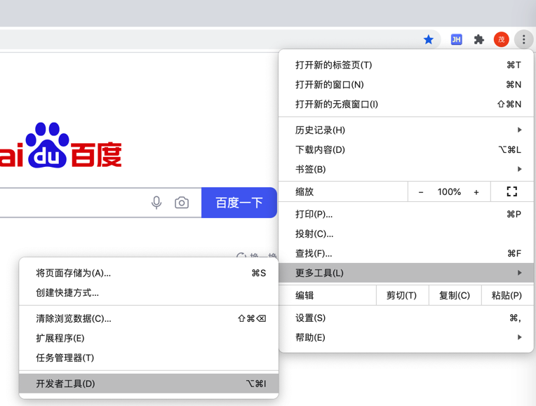

打开后效果：

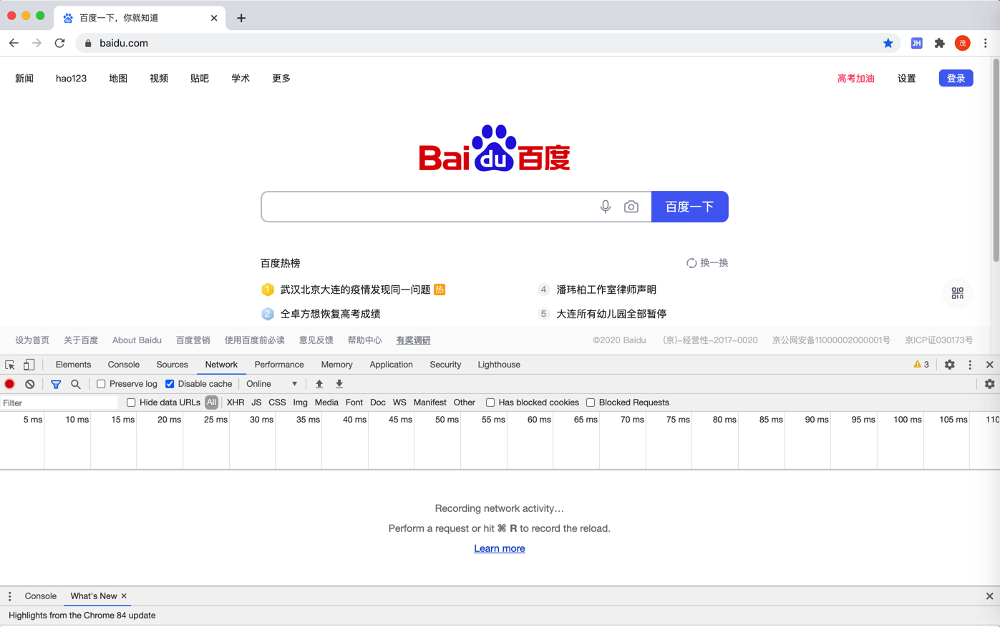

先了解一下简单但常用的功能

比如最常见的 查看元素：

右键 -> 检查

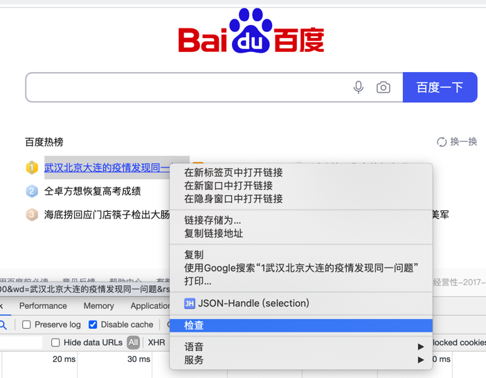

即可看到：

坐标的Elements，表示 显示html网页源码

以及 右边是 css的Styles部分

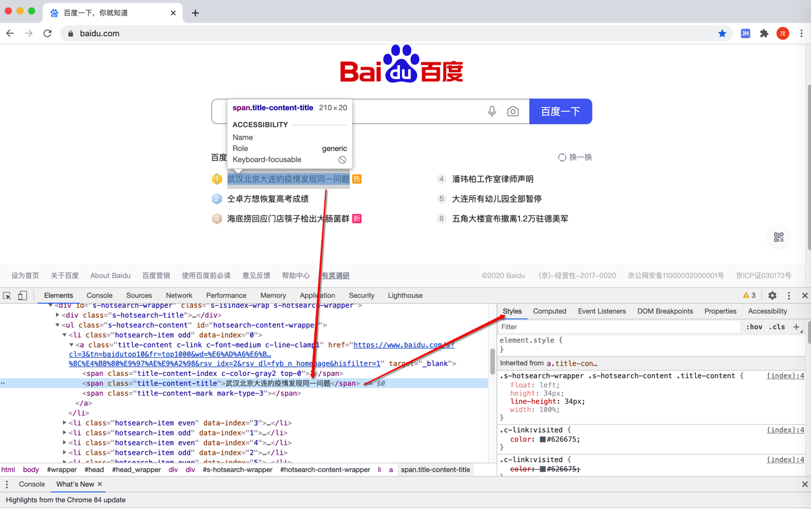

此处，我们目的是：分析 百度热榜中的内容列表 是如何加载出来的

所以先去根据列表中第一个元素的内容：

`武汉北京大连的疫情发现同一问题`

去尝试搜索Network部分中的内容（请求或返回的响应中）能否搜索到

步骤：

切换到`Network`一栏：

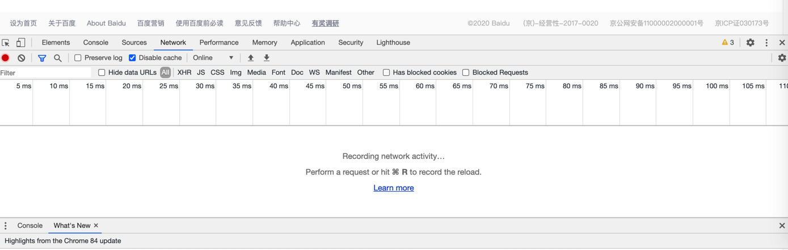

可见，此处是空的

原因是，在打开 开发者工具之前我们就已经加载完毕页面，所以 开发者工具没有记录到内容。

先去使得工具能看到当前网页加载所有内容的过程和请求的列表，则思路就是：重新加载网页

其中也可以看到也有对应提示：

> Recording network activity ...
> 
> Perform a request or hit Command+R to record the reload

所以去 重新刷新页面

快捷键：Command+R

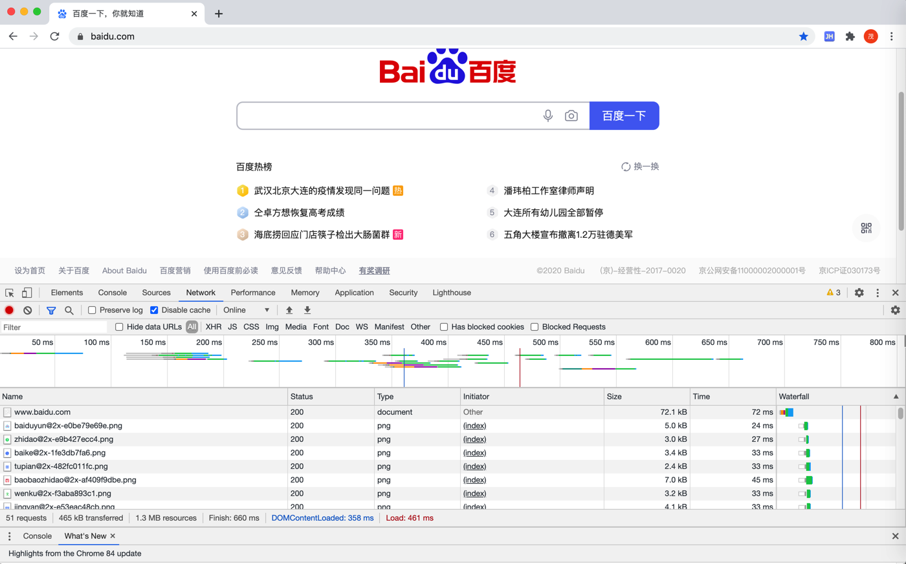

就可以看到网页内容加载的细节和具体每个请求和详情了。

接下来再去找我们的要的内容。

先打开搜索：

点击`搜索`按钮：

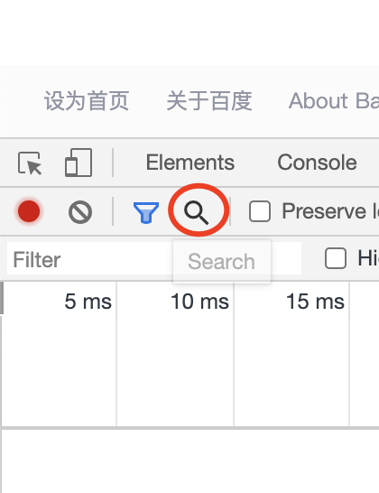

或快捷键：`Command+F`

即可打开搜索界面：

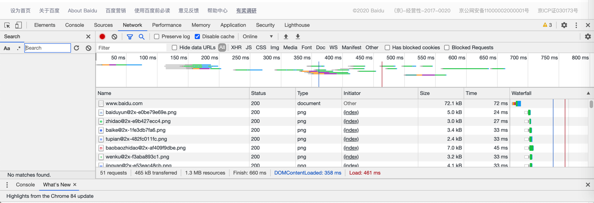

输入要搜的内容：`武汉北京大连的疫情发现同一问题`，并回车触发搜索

此处可以搜到一条记录，点击会跳转过去：

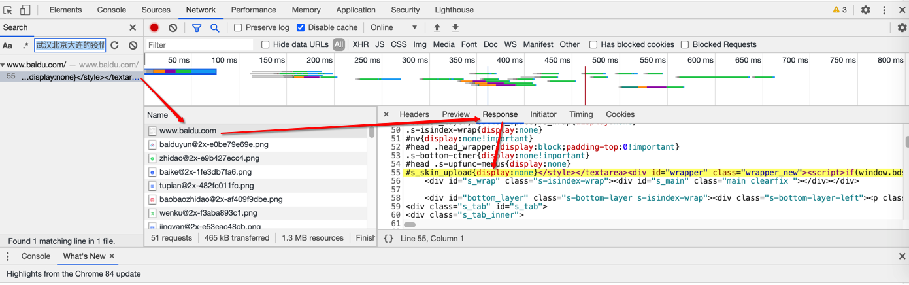

此处可以看出是：

`www.baidu.com`

的这条记录中的`Response`部分返回的`html`源码中包含了我们要搜索的内容

双击选中并复制该行：

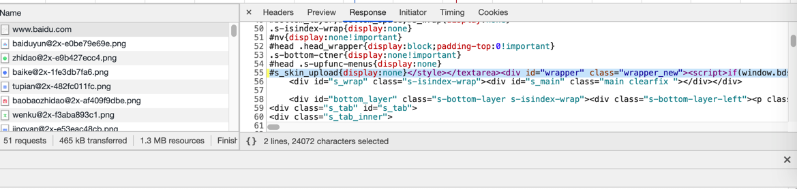

粘贴出来，放到编辑器中去研究内容，比如放到[VSCode](https://book.crifan.com/books/best_editor_vscode/website/)中：

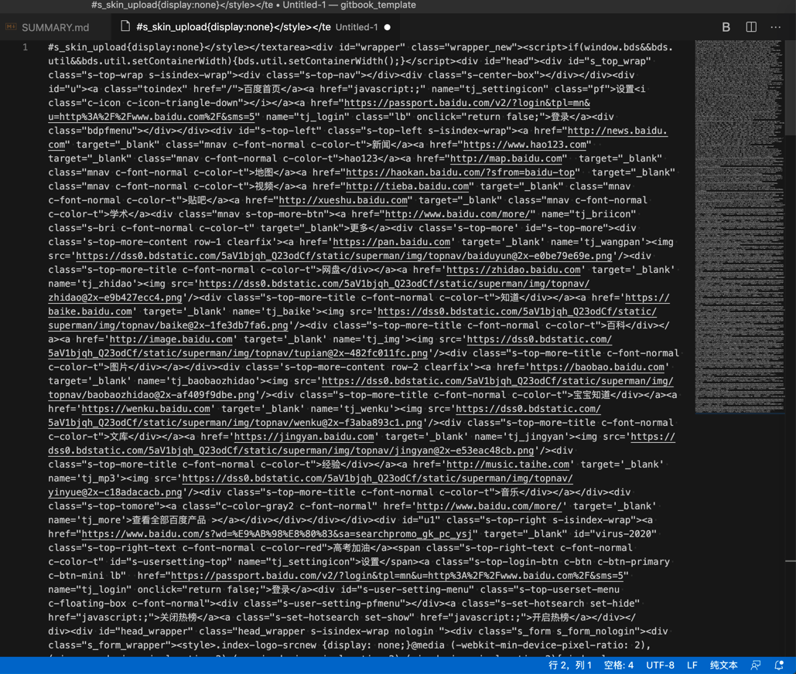

找到对应的内容所在位置：

搜 `武汉北京大连的疫情发现同一问题`，找到2处：

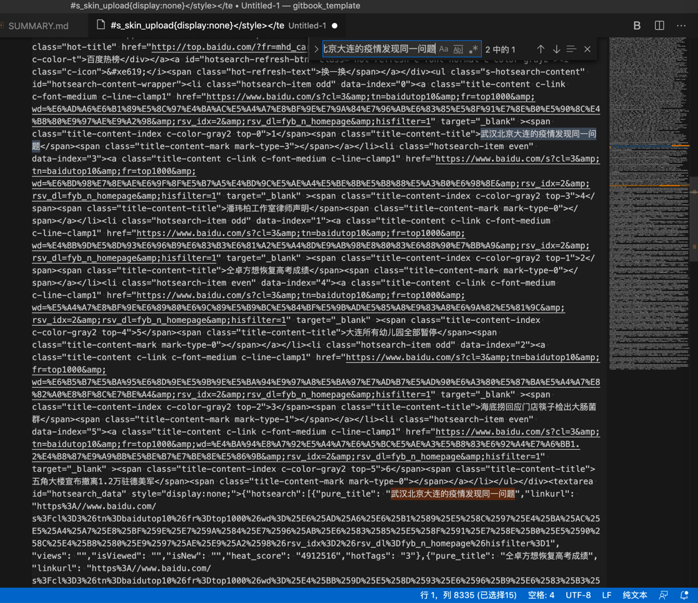

从经验来看，对于是要显示的html内容来说，第一条更像是我们要的

且再仔细看源码发现，前面有`百度热榜`的字样以及前面是`ul`的列表：

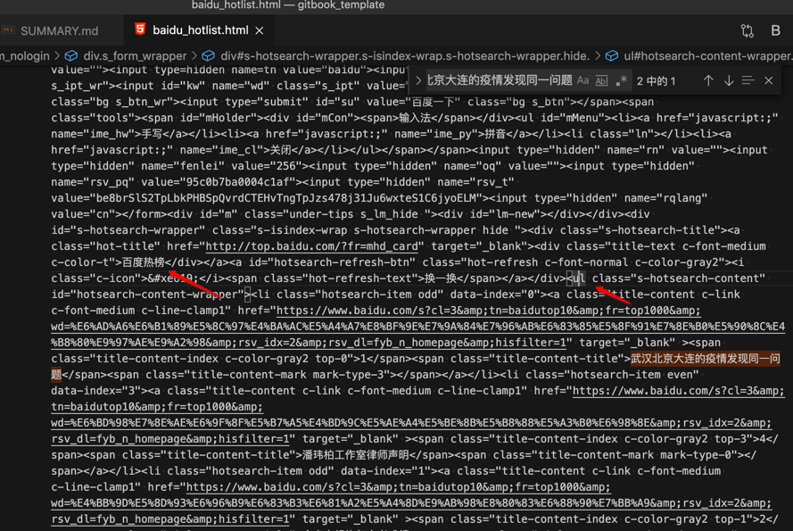

更验证了之前的推断。

把ul这部分html源码拷贝出来：

```html
<ul class="s-hotsearch-content" id="hotsearch-content-wrapper"><li class="hotsearch-item odd" data-index="0"><a class="title-content c-link c-font-medium c-line-clamp1" href="https://www.baidu.com/s?cl=3&tn=baidutop10&fr=top1000&wd=%E6%AD%A6%E6%B1%89%E5%8C%97%E4%BA%AC%E5%A4%A7%E8%BF%9E%E7%9A%84%E7%96%AB%E6%83%85%E5%8F%91%E7%8E%B0%E5%90%8C%E4%B8%80%E9%97%AE%E9%A2%98&rsv_idx=2&rsv_dl=fyb_n_homepage&hisfilter=1" target="_blank" ><span class="title-content-index c-color-gray2 top-0">1</span><span class="title-content-title">武汉北京大连的疫情发现同一问题</span><span class="title-content-mark mark-type-3"></span></a></li><li class="hotsearch-item even" data-index="3"><a class="title-content c-link c-font-medium c-line-clamp1" href="https://www.baidu.com/s?cl=3&tn=baidutop10&fr=top1000&wd=%E6%BD%98%E7%8E%AE%E6%9F%8F%E5%B7%A5%E4%BD%9C%E5%AE%A4%E5%BE%8B%E5%B8%88%E5%A3%B0%E6%98%8E&rsv_idx=2&rsv_dl=fyb_n_homepage&hisfilter=1" target="_blank" ><span class="title-content-index c-color-gray2 top-3">4</span><span class="title-content-title">潘玮柏工作室律师声明</span><span class="title-content-mark mark-type-0"></span></a></li><li class="hotsearch-item odd" data-index="1"><a class="title-content c-link c-font-medium c-line-clamp1" href="https://www.baidu.com/s?cl=3&tn=baidutop10&fr=top1000&wd=%E4%BB%9D%E5%8D%93%E6%96%B9%E6%83%B3%E6%81%A2%E5%A4%8D%E9%AB%98%E8%80%83%E6%88%90%E7%BB%A9&rsv_idx=2&rsv_dl=fyb_n_homepage&hisfilter=1" target="_blank" ><span class="title-content-index c-color-gray2 top-1">2</span><span class="title-content-title">仝卓方想恢复高考成绩</span><span class="title-content-mark mark-type-0"></span></a></li><li class="hotsearch-item even" data-index="4"><a class="title-content c-link c-font-medium c-line-clamp1" href="https://www.baidu.com/s?cl=3&tn=baidutop10&fr=top1000&wd=%E5%A4%A7%E8%BF%9E%E6%89%80%E6%9C%89%E5%B9%BC%E5%84%BF%E5%9B%AD%E5%85%A8%E9%83%A8%E6%9A%82%E5%81%9C&rsv_idx=2&rsv_dl=fyb_n_homepage&hisfilter=1" target="_blank" ><span class="title-content-index c-color-gray2 top-4">5</span><span class="title-content-title">大连所有幼儿园全部暂停</span><span class="title-content-mark mark-type-0"></span></a></li><li class="hotsearch-item odd" data-index="2"><a class="title-content c-link c-font-medium c-line-clamp1" href="https://www.baidu.com/s?cl=3&tn=baidutop10&fr=top1000&wd=%E6%B5%B7%E5%BA%95%E6%8D%9E%E5%9B%9E%E5%BA%94%E9%97%A8%E5%BA%97%E7%AD%B7%E5%AD%90%E6%A3%80%E5%87%BA%E5%A4%A7%E8%82%A0%E8%8F%8C%E7%BE%A4&rsv_idx=2&rsv_dl=fyb_n_homepage&hisfilter=1" target="_blank" ><span class="title-content-index c-color-gray2 top-2">3</span><span class="title-content-title">海底捞回应门店筷子检出大肠菌群</span><span class="title-content-mark mark-type-1"></span></a></li><li class="hotsearch-item even" data-index="5"><a class="title-content c-link c-font-medium c-line-clamp1" href="https://www.baidu.com/s?cl=3&tn=baidutop10&fr=top1000&wd=%E4%BA%94%E8%A7%92%E5%A4%A7%E6%A5%BC%E5%AE%A3%E5%B8%83%E6%92%A4%E7%A6%BB1.2%E4%B8%87%E9%A9%BB%E5%BE%B7%E7%BE%8E%E5%86%9B&rsv_idx=2&rsv_dl=fyb_n_homepage&hisfilter=1" target="_blank" ><span class="title-content-index c-color-gray2 top-5">6</span><span class="title-content-title">五角大楼宣布撤离1.2万驻德美军</span><span class="title-content-mark mark-type-0"></span></a></li></ul>
```

且为了便于研究，再单独存到另外一个文件，且设置为HTML格式，使得语法高亮，便于阅读：

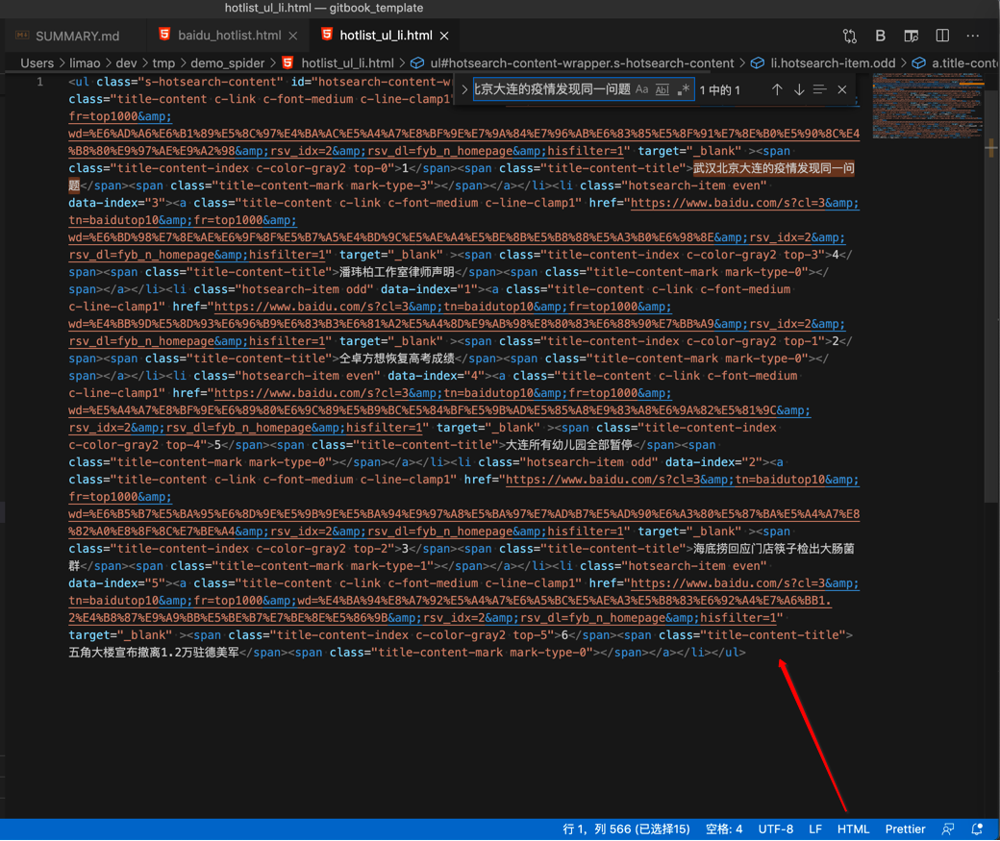

然后去研究代码，稍微懂点html的，即可了解其基本逻辑：

此处第一个li的元素：武汉北京大连的疫情发现同一问题

对应源码就是：

```html
<li class="hotsearch-item odd" data-index="0"><a class="title-content c-link c-font-medium c-line-clamp1" href="https://www.baidu.com/s?cl=3&tn=baidutop10&fr=top1000&wd=%E6%AD%A6%E6%B1%89%E5%8C%97%E4%BA%AC%E5%A4%A7%E8%BF%9E%E7%9A%84%E7%96%AB%E6%83%85%E5%8F%91%E7%8E%B0%E5%90%8C%E4%B8%80%E9%97%AE%E9%A2%98&rsv_idx=2&rsv_dl=fyb_n_homepage&hisfilter=1" target="_blank" ><span class="title-content-index c-color-gray2 top-0">1</span><span class="title-content-title">武汉北京大连的疫情发现同一问题</span><span class="title-content-mark mark-type-3"></span></a></li>
```

其后的其他几个热榜节点的格式也是类似的，只不过是

* `hotsearch-item`是`even`
* `data-index=1`

等等细节不同：

```html
<li class="hotsearch-item even" data-index="3"><a class="title-content c-link c-font-medium c-line-clamp1" href="https://www.baidu.com/s?cl=3&tn=baidutop10&fr=top1000&wd=%E6%BD%98%E7%8E%AE%E6%9F%8F%E5%B7%A5%E4%BD%9C%E5%AE%A4%E5%BE%8B%E5%B8%88%E5%A3%B0%E6%98%8E&rsv_idx=2&rsv_dl=fyb_n_homepage&hisfilter=1" target="_blank" ><span class="title-content-index c-color-gray2 top-3">4</span><span class="title-content-title">潘玮柏工作室律师声明</span><span class="title-content-mark mark-type-0"></span></a></li>
```

所以，对于上述内容，此处研究出来的逻辑是：

如果能正常获取到 

https://www.baidu.com/

的html源码，且内容已加载完毕的情况下

则直接去使用此简化规则去匹配内容：

```html
<span class="title-content-title">xxx</span>
```

其中xxx是中文字符串，是此处希望找到的内容的标题。

说明：自己要确保此规则不会和导致误判，多了或少了，即匹配出其他的额外的不想要的内容，或漏了某些想要的内容。

当误判时，就需要加上其他限定条件，比如此处的：

`父级节点是：li中 class="hotsearch-item even" 或 "hotsearch-item odd"`

对于上述简化规则，再去用代码实现，提取要的内容：

（1）Python中re正则
```python
contentTitleP = '<span\s+class="title-content-title">(?P<contentTitle>[^<>]+)</span>'
```

（2）Python的用于解析html的第三方库BeautifulSoup
```python
allTitleSoupList = soup.find_all("span", attrs={"class":"title-content-title"})
```

至此，要抓取的内容的提取规则，已分析完毕。

接下来，就是回头再去确保，可以正常获取到

https://www.baidu.com/

的源码，即可。

对此，往往不太容易一次性就很轻松的获取各个网站的网页源码。

所以一般的逻辑是：直接去写代码，然后出现问题，变调试，变优化代码，直到最终获取到源码

期间继续调试逻辑：

切换到Headers界面：

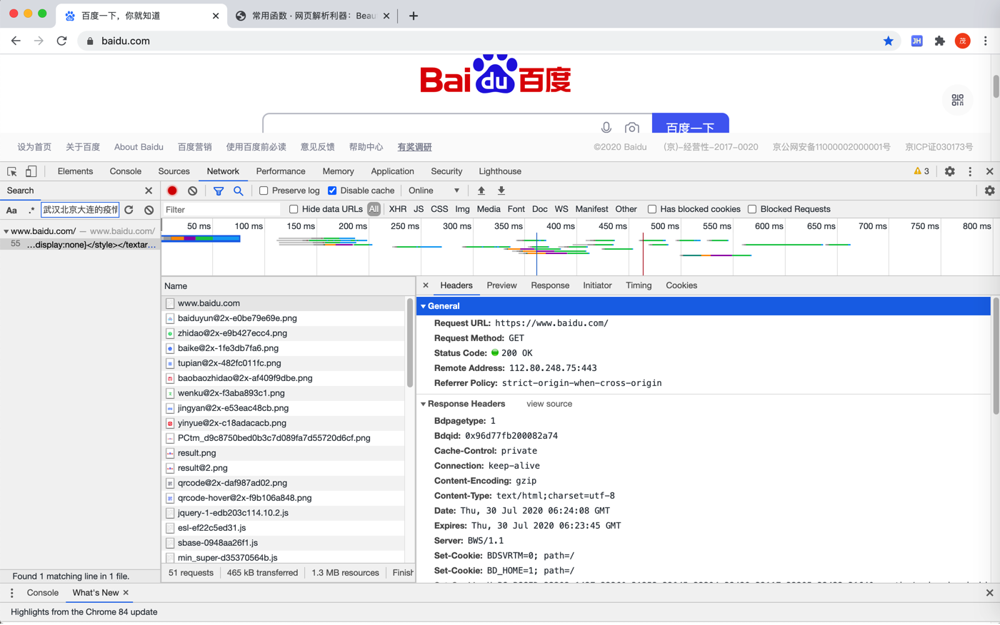

找到`Request Headers`中的`User-Agent`部分：

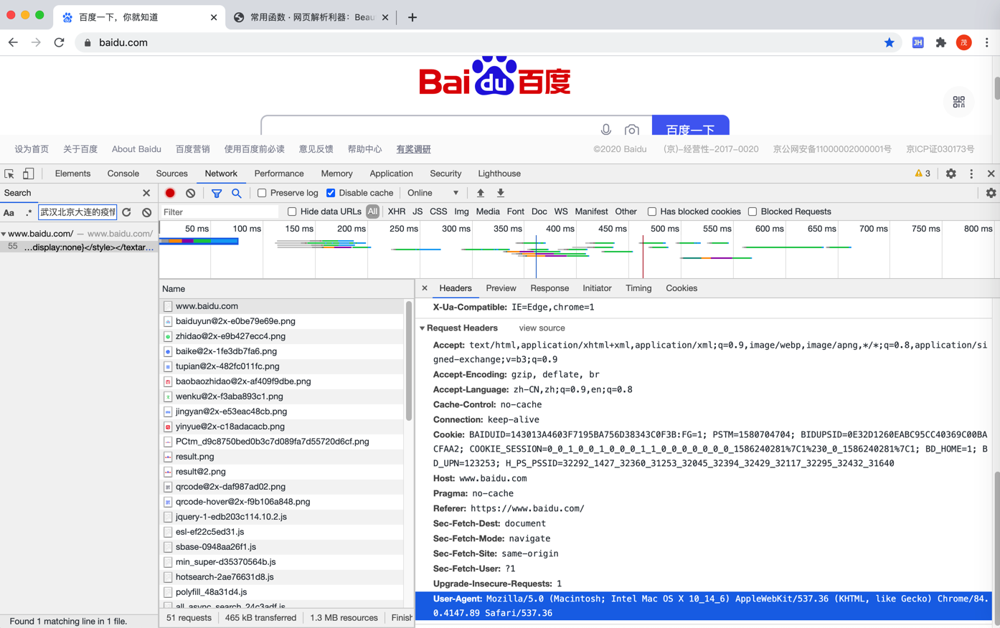

拷贝出来是：

```
User-Agent: Mozilla/5.0 (Macintosh; Intel Mac OS X 10_14_6) AppleWebKit/537.36 (KHTML, like Gecko) Chrome/84.0.4147.89 Safari/537.36
```

用于后续代码中使用。
