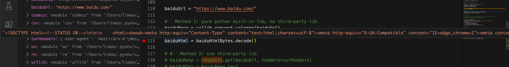
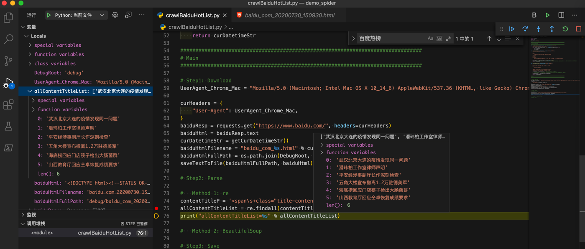

# 用纯内置库裸写

此处使用纯Python的库，主要是：

* 下载=HTTP网络库下载HTML源码
  * urllib
* 解析=解析提取所需内容
  * 正则
    * re


核心代码：

用内置网络库：`urllib`：

```python
import urllib.request

baiduUrl = "https://www.baidu.com/"

#   Method 1 (pure python built-in lib, no third-party lib): urllib
baiduResp = urllib.request.urlopen(baiduUrl)
baiduHtmlBytes = baiduResp.read()
baiduHtml = baiduHtmlBytes.decode()
```

即可获取到HTML源码：




或许用内置库：正则`re`：

```python
# Step2: Parse
#   Method 1: re
contentTitleP = '<span\s+class="title-content-title">(?P<contentTitle>[^<>]+)</span>'
allContentTitleList = re.findall(contentTitleP, baiduHtml)
print("allContentTitleList=%s" % allContentTitleList)
```

即可匹配出要的热榜标题列表：



## 完整代码

```python
# Function: Demo how use Python crawl baidu.com 百度热榜
# Author: Crifan
# Update: 20200731

import os
import codecs
from datetime import datetime,timedelta

import urllib.request
import re

# import requests
# from bs4 import BeautifulSoup

import csv

DebugRoot = "debug"
OutputRoot = "output"

################################################################################
# Utils Functions
################################################################################

def createFolder(folderFullPath):
    """
        create folder, even if already existed
        Note: for Python 3.2+
    """
    os.makedirs(folderFullPath, exist_ok=True)

def saveTextToFile(fullFilename, text, fileEncoding="utf-8"):
    """save text content into file"""
    with codecs.open(fullFilename, 'w', encoding=fileEncoding) as fp:
        fp.write(text)
        fp.close()

def datetimeToStr(inputDatetime, format="%Y%m%d_%H%M%S"):
    """Convert datetime to string

    Args:
        inputDatetime (datetime): datetime value
    Returns:
        str
    Raises:
    Examples:
        datetime.datetime(2020, 4, 21, 15, 44, 13, 2000) -> '20200421_154413'
    """
    datetimeStr = inputDatetime.strftime(format=format)
    # print("inputDatetime=%s -> datetimeStr=%s" % (inputDatetime, datetimeStr)) # 2020-04-21 15:08:59.787623
    return datetimeStr

def getCurDatetimeStr(outputFormat="%Y%m%d_%H%M%S"):
    """
    get current datetime then format to string

    eg:
        20171111_220722

    :param outputFormat: datetime output format
    :return: current datetime formatted string
    """
    curDatetime = datetime.now() # 2017-11-11 22:07:22.705101
    # curDatetimeStr = curDatetime.strftime(format=outputFormat) #'20171111_220722'
    curDatetimeStr = datetimeToStr(curDatetime)
    return curDatetimeStr

def saveToCsvByDictList(csvDictList, outputFilePath):
    # generate csv headers from dict list
    firstItemDict = csvDictList[0]
    csvHeaders = list(firstItemDict.keys())
    with codecs.open(outputFilePath, "w", "UTF-8") as outCsvFp:
        csvDictWriter = csv.DictWriter(outCsvFp, fieldnames=csvHeaders)

        # write header by inner function from fieldnames
        csvDictWriter.writeheader()

        for eachRowDict in csvDictList:
            csvDictWriter.writerow(eachRowDict)

def saveToCsvByHeaderAndList(csvHeaderList, csvRowListList, outputFilePath):
    with codecs.open(outputFilePath, "w", "UTF-8") as outCsvFp:
        csvWriter = csv.writer(outCsvFp)

        # write header from list
        csvWriter.writerow(csvHeaderList)

        # type1: write each row
        # for eachRowList in csvRowListList:
        #   csvWriter.writerow(eachRowList)

        # type2: write all rows
        csvWriter.writerows(csvRowListList)

################################################################################
# Main
################################################################################

createFolder(DebugRoot)
createFolder(OutputRoot)

curDatetimeStr = getCurDatetimeStr()

# Step1: Download
UserAgent_Chrome_Mac = "Mozilla/5.0 (Macintosh; Intel Mac OS X 10_14_6) AppleWebKit/537.36 (KHTML, like Gecko) Chrome/84.0.4147.89 Safari/537.36"

curHeaders = {
    "User-Agent": UserAgent_Chrome_Mac,
}

baiduUrl = "https://www.baidu.com/"

#   Method 1 (pure python built-in lib, no third-party lib): urllib
baiduResp = urllib.request.urlopen(baiduUrl)
baiduHtmlBytes = baiduResp.read()
baiduHtml = baiduHtmlBytes.decode()

# #   Method 2 (use third-party lib): requests
# baiduResp = requests.get(baiduUrl, headers=curHeaders)
# baiduHtml = baiduResp.text

# for debug
baiduHtmlFilename = "baidu_com_%s.html" % curDatetimeStr
baiduHtmlFullPath = os.path.join(DebugRoot, baiduHtmlFilename)
saveTextToFile(baiduHtmlFullPath, baiduHtml)

# Step2: Parse=Extract

#   Method 1 (pure python built-in lib, no third-party lib): re
contentTitleP = '<span\s+class="title-content-title">(?P<contentTitle>[^<>]+)</span>'
allContentTitleList = re.findall(contentTitleP, baiduHtml)

# #   Method 2 (use third-party lib): BeautifulSoup
# soup = BeautifulSoup(baiduHtml, 'html.parser')
# allTitleSoupList = soup.find_all("span", attrs={"class":"title-content-title"})
# print("allTitleSoupList=%s" % allTitleSoupList)
# allContentTitleList = []
# for eachTitleSoup in allTitleSoupList:
#     titleStr = eachTitleSoup.string
#     allContentTitleList.append(titleStr)

print("allContentTitleList=%s" % allContentTitleList)

# Step3: Save

# save to csv
OutputCsvHeader = ["序号", "百度热榜标题"]
OutputCsvFilename = "BaiduHotTitleList_%s.csv" % curDatetimeStr
OutputCsvFullPath = os.path.join(OutputRoot, OutputCsvFilename)

outputCsvDictList = []
for curIdx, eachTitle in enumerate(allContentTitleList):
    curNum = curIdx + 1
    csvDict = {
        "序号": curNum,
        "百度热榜标题": eachTitle
    }
    outputCsvDictList.append(csvDict)

saveToCsvByDictList(outputCsvDictList, OutputCsvFullPath)
print("Completed save data to %s" % OutputCsvFullPath)

```
