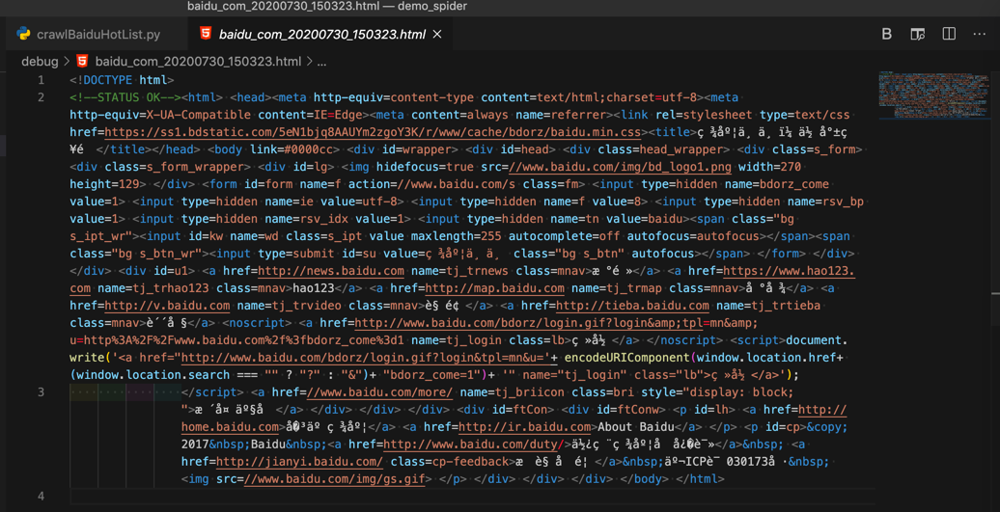
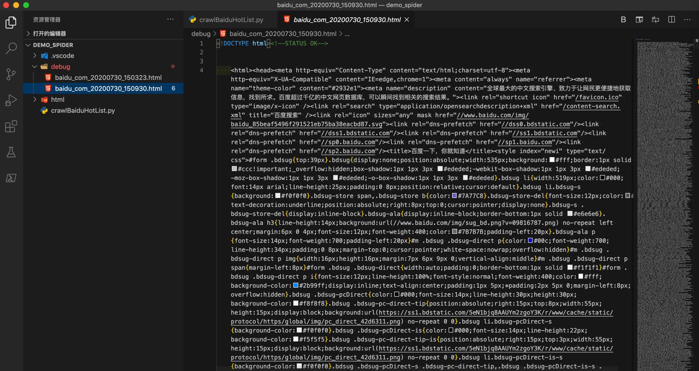
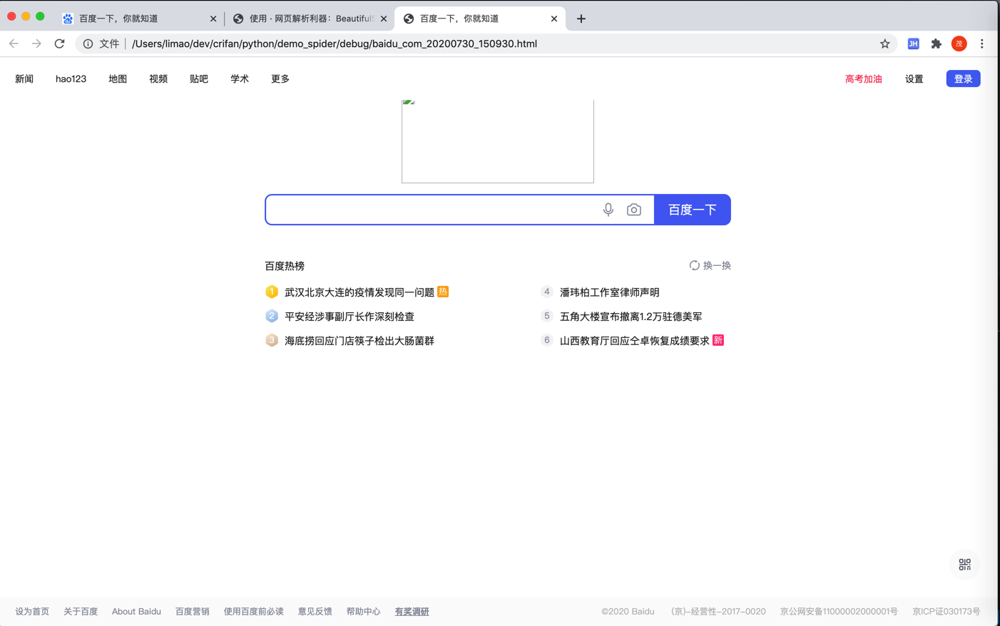
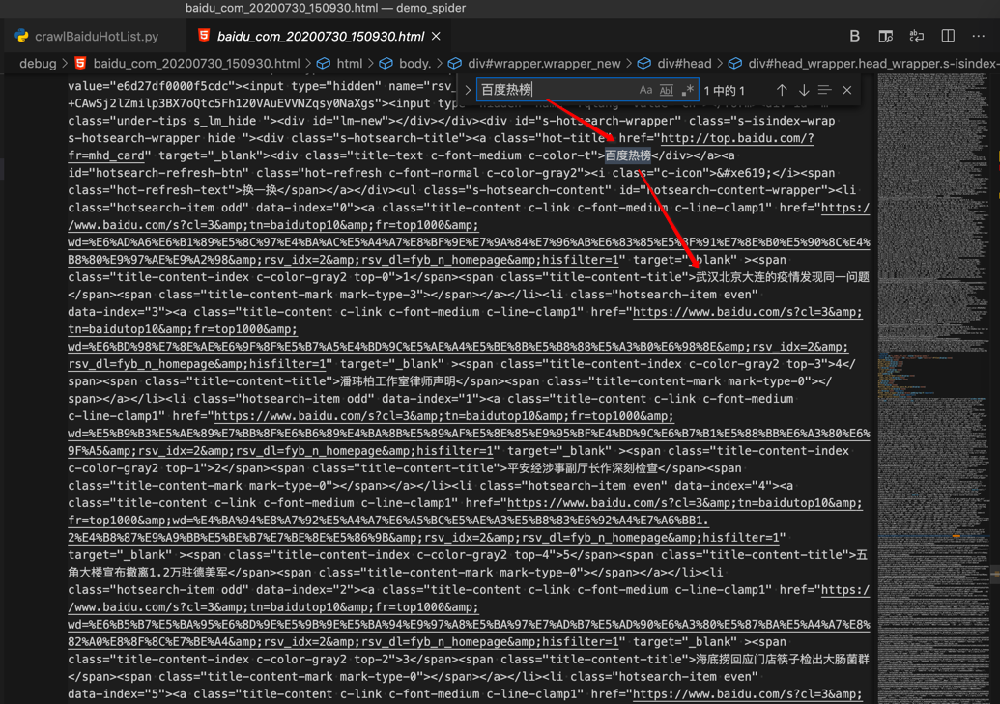
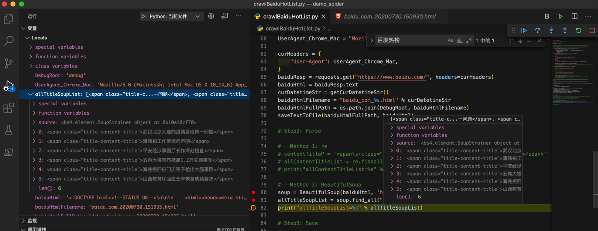
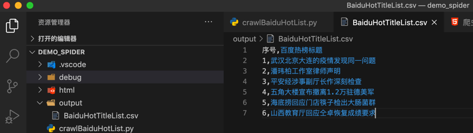
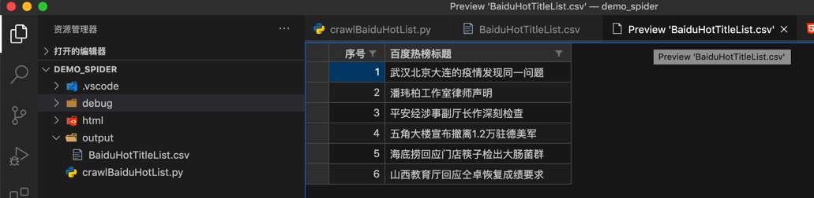
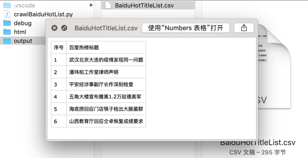

# 用第三方Python库

此处记录从无到有的核心过程：

先写出核心代码：

```python
import requests

baiduResp = requests.get("https://www.baidu.com/")
baiduHtml = baiduResp.text
curDatetimeStr = getCurDatetimeStr()
baiduHtmlFilename = "baidu_com_%s.html" % curDatetimeStr
baiduHtmlFullPath = os.path.join(DebugRoot, baiduHtmlFilename)
saveTextToFile(baiduHtmlFullPath, baiduHtml)
```

调试返回的html源码是：



很明显：没有包含我们希望的`百度热榜`的内容，且连其他的中文，比如`百度一下`之类的字眼都看不到

那么根据经验，需要加其他参数，甚至额外逻辑，才可能获取完整的html代码

而最先要去加上的，就是`User-Agent`

先去回去用 Chrome的开发者工具，看看当前的User-Agent是啥，找到值。

再去把User-Agent部分，加到requests中：

```python
UserAgent_Chrome_Mac = "Mozilla/5.0 (Macintosh; Intel Mac OS X 10_14_6) AppleWebKit/537.36 (KHTML, like Gecko) Chrome/84.0.4147.89 Safari/537.36"

curHeaders = {
    "User-Agent": UserAgent_Chrome_Mac,
}
baiduResp = requests.get("https://www.baidu.com/", headers=curHeaders)
```

再去试试，此处我们很幸运，立刻就可以返回，大量的内容：



看起来就是正确的，估计包含我们要找到的 百度热榜 的内容了。

另外顺带，直接用浏览器打开此处抓取到的本地的离线的html，看看效果是什么样的：



可见（由于本身页面简单不复杂），除了首页logo外，页面效果和浏览器打开的基本一致。

也验证了前面的推测，确认就是完整的源码了。

去搜索 百度热榜



的确可以找到我们要的内容。

> #### warning:: 更多情况下获取完整的全部源码要难很多
> 
> 此处只加了`User-Agent`就可以返回所需全部的完整的页面源码，是很幸运的。
> 
> 因为随着web技术发展，反扒技术进步，稍微有点点技术含量的公司所做的web页面，尤其是页面逻辑复杂的，涉及到多个页面的
> 
> 想要获取完整页面源码，往往都需要加上其他更多参数，才（可）能获取到期望的返回结果。
> 
> 而关于`其他更多参数`，常见的一些有：
> * 简单的
>     * Accept
>     * Accept-Encoding
>     * Accept-Language
>     * Host
>     * Referer
> * 复杂的
>     * Cookie
>         * 很多值，很难获取到（搞懂生成的逻辑）

所以可以接着，去用之前分析出的规则，去解析内容了。

此处用第三方Python的HTML解析库`BeautifulSoup`：

```python
#   Method 2: BeautifulSoup
soup = BeautifulSoup(baiduHtml, 'html.parser')
allTitleSoupList = soup.find_all("span", attrs={"class":"title-content-title"})
print("allTitleSoupList=%s" % allTitleSoupList)
```

可以解析到所需内容：




再去加上代码，把`soup`的`string`保存出来：

```python
allContentTitleList = []
for eachTitleSoup in allTitleSoupList:
    titleStr = eachTitleSoup.string
    allContentTitleList.append(titleStr)
print("allContentTitleList=%s" % allContentTitleList)
```

就是我们要的列表了：

```bash
allContentTitleList=['武汉北京大连的疫情发现同一问题', '潘玮柏工作室律师声明', '平安经涉事副厅长作深刻检查', '五角大楼宣布撤离1.2万驻德美军', '海底捞回应门店筷子检出大肠菌群', '山西教育厅回应仝卓恢复成绩要求']
```

至此下载和提取都完成了

接着去保存内容，如前面假设，比如保存到csv文件中

```python
def saveToCsvByDictList(csvDictList, outputFilePath):
    # generate csv headers from dict list
    firstItemDict = csvDictList[0]
    csvHeaders = list(firstItemDict.keys())
    with codecs.open(outputFilePath, "w", "UTF-8") as outCsvFp:
        csvDictWriter = csv.DictWriter(outCsvFp, fieldnames=csvHeaders)

        # write header by inner function from fieldnames
        csvDictWriter.writeheader()

        for eachRowDict in csvDictList:
            csvDictWriter.writerow(eachRowDict)

# save to csv
OutputCsvHeader = ["序号", "百度热榜标题"]
OutputCsvFilename = "BaiduHotTitleList.csv"
OutputCsvFullPath = os.path.join(OutputRoot, OutputCsvFilename)

outputCsvDictList = []
for curIdx, eachTitle in enumerate(allContentTitleList):
    curNum = curIdx + 1
    csvDict = {
        "序号": curNum,
        "百度热榜标题": eachTitle
    }
    outputCsvDictList.append(csvDict)

saveToCsvByDictList(outputCsvDictList, OutputCsvFullPath)
```

即可保存出我们要的csv文件：



以及，用VSCode中csv插件去以列表方式查看的效果：



和Mac中的预览效果：



至此，实现完整的爬虫功能：

* 下载百度首页源码
* 提取所需的百度热榜的标题内容
* 保存内容为csv格式

## 完整代码

```python
# Function: Demo how use Python crawl baidu.com 百度热榜
# Author: Crifan
# Update: 20200731

import os
import codecs
from datetime import datetime,timedelta

# import urllib.request
# import re

import requests
from bs4 import BeautifulSoup

import csv

DebugRoot = "debug"
OutputRoot = "output"

################################################################################
# Utils Functions
################################################################################

def createFolder(folderFullPath):
    """
        create folder, even if already existed
        Note: for Python 3.2+
    """
    os.makedirs(folderFullPath, exist_ok=True)

def saveTextToFile(fullFilename, text, fileEncoding="utf-8"):
    """save text content into file"""
    with codecs.open(fullFilename, 'w', encoding=fileEncoding) as fp:
        fp.write(text)
        fp.close()

def datetimeToStr(inputDatetime, format="%Y%m%d_%H%M%S"):
    """Convert datetime to string

    Args:
        inputDatetime (datetime): datetime value
    Returns:
        str
    Raises:
    Examples:
        datetime.datetime(2020, 4, 21, 15, 44, 13, 2000) -> '20200421_154413'
    """
    datetimeStr = inputDatetime.strftime(format=format)
    # print("inputDatetime=%s -> datetimeStr=%s" % (inputDatetime, datetimeStr)) # 2020-04-21 15:08:59.787623
    return datetimeStr

def getCurDatetimeStr(outputFormat="%Y%m%d_%H%M%S"):
    """
    get current datetime then format to string

    eg:
        20171111_220722

    :param outputFormat: datetime output format
    :return: current datetime formatted string
    """
    curDatetime = datetime.now() # 2017-11-11 22:07:22.705101
    # curDatetimeStr = curDatetime.strftime(format=outputFormat) #'20171111_220722'
    curDatetimeStr = datetimeToStr(curDatetime)
    return curDatetimeStr

def saveToCsvByDictList(csvDictList, outputFilePath):
    # generate csv headers from dict list
    firstItemDict = csvDictList[0]
    csvHeaders = list(firstItemDict.keys())
    with codecs.open(outputFilePath, "w", "UTF-8") as outCsvFp:
        csvDictWriter = csv.DictWriter(outCsvFp, fieldnames=csvHeaders)

        # write header by inner function from fieldnames
        csvDictWriter.writeheader()

        for eachRowDict in csvDictList:
            csvDictWriter.writerow(eachRowDict)

def saveToCsvByHeaderAndList(csvHeaderList, csvRowListList, outputFilePath):
    with codecs.open(outputFilePath, "w", "UTF-8") as outCsvFp:
        csvWriter = csv.writer(outCsvFp)

        # write header from list
        csvWriter.writerow(csvHeaderList)

        # type1: write each row
        # for eachRowList in csvRowListList:
        #   csvWriter.writerow(eachRowList)

        # type2: write all rows
        csvWriter.writerows(csvRowListList)

################################################################################
# Main
################################################################################

createFolder(DebugRoot)
createFolder(OutputRoot)

curDatetimeStr = getCurDatetimeStr()

# Step1: Download
UserAgent_Chrome_Mac = "Mozilla/5.0 (Macintosh; Intel Mac OS X 10_14_6) AppleWebKit/537.36 (KHTML, like Gecko) Chrome/84.0.4147.89 Safari/537.36"

curHeaders = {
    "User-Agent": UserAgent_Chrome_Mac,
}

baiduUrl = "https://www.baidu.com/"

# #   Method 1 (pure python built-in lib, no third-party lib): urllib
# baiduResp = urllib.request.urlopen(baiduUrl)
# baiduHtmlBytes = baiduResp.read()
# baiduHtml = baiduHtmlBytes.decode()

#   Method 2 (use third-party lib): requests
baiduResp = requests.get(baiduUrl, headers=curHeaders)
baiduHtml = baiduResp.text

# for debug
baiduHtmlFilename = "baidu_com_%s.html" % curDatetimeStr
baiduHtmlFullPath = os.path.join(DebugRoot, baiduHtmlFilename)
saveTextToFile(baiduHtmlFullPath, baiduHtml)

# Step2: Parse=Extract

# #   Method 1 (pure python built-in lib, no third-party lib): re
# contentTitleP = '<span\s+class="title-content-title">(?P<contentTitle>[^<>]+)</span>'
# allContentTitleList = re.findall(contentTitleP, baiduHtml)

#   Method 2 (use third-party lib): BeautifulSoup
soup = BeautifulSoup(baiduHtml, 'html.parser')
allTitleSoupList = soup.find_all("span", attrs={"class":"title-content-title"})
print("allTitleSoupList=%s" % allTitleSoupList)
allContentTitleList = []
for eachTitleSoup in allTitleSoupList:
    titleStr = eachTitleSoup.string
    allContentTitleList.append(titleStr)

print("allContentTitleList=%s" % allContentTitleList)

# Step3: Save

# save to csv
OutputCsvHeader = ["序号", "百度热榜标题"]
OutputCsvFilename = "BaiduHotTitleList_%s.csv" % curDatetimeStr
OutputCsvFullPath = os.path.join(OutputRoot, OutputCsvFilename)

outputCsvDictList = []
for curIdx, eachTitle in enumerate(allContentTitleList):
    curNum = curIdx + 1
    csvDict = {
        "序号": curNum,
        "百度热榜标题": eachTitle
    }
    outputCsvDictList.append(csvDict)

saveToCsvByDictList(outputCsvDictList, OutputCsvFullPath)
print("Completed save data to %s" % OutputCsvFullPath)
```
