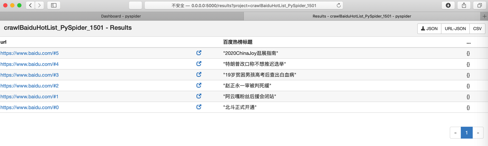

# 用爬虫框架

此处再去把同样爬虫功能，换成第三方的爬虫框架[PySpider](http://book.crifan.com/books/python_spider_pyspider/website)去实现。

* 准备工作
  * 安装：`pip install pyspider`
  * 启动：`pyspider`

经过调试，效果是：

调试时能看到输出多个message的结果：


去`Run`运行项目：


运行完毕后，点击`Results`，进入结果页面：



点击`CSV`显示（也可以保存下载）结果：


下载或拷贝出来，放到VSCode中，预览效果为：


即可实现最终要的结果。


## 完整代码

```python
#!/usr/bin/env python
# -*- encoding: utf-8 -*-
# Created on 2020-07-31 15:01:00
# Project: crawlBaiduHotList_PySpider_1501

from pyspider.libs.base_handler import *
from pyspider.database import connect_database  

class Handler(BaseHandler):
    crawl_config = {
    }

    # @every(minutes=24 * 60)
    def on_start(self):
        UserAgent_Chrome_Mac = "Mozilla/5.0 (Macintosh; Intel Mac OS X 10_14_6) AppleWebKit/537.36 (KHTML, like Gecko) Chrome/84.0.4147.89 Safari/537.36"
        curHeaderDict = {
            "User-Agent": UserAgent_Chrome_Mac,
        }
        self.crawl('https://www.baidu.com/', callback=self.baiduHome, headers=curHeaderDict)

    # @config(age=10 * 24 * 60 * 60)
    def baiduHome(self, response):
        # for eachItem in response.doc('span[class="title-content-title"]').items():

        titleItemGenerator = response.doc('span[class="title-content-title"]').items()
        titleItemList = list(titleItemGenerator)
        print("titleItemList=%s" % titleItemList)
        # for eachItem in titleItemList:
        for curIdx, eachItem in enumerate(titleItemList):
            print("[%d] eachItem=%s" % (curIdx, eachItem))
            itemTitleStr = eachItem.text()
            print("itemTitleStr=%s" % itemTitleStr)
            curUrl = "%s#%d" % (response.url, curIdx)
            print("curUrl=%s" % curUrl)
            curResult = {
                # "url": response.url,
                # "url": curUrl,
                "百度热榜标题": itemTitleStr,
            }
            # return curResult
            # self.send_message(self.project_name, curResult, url=response.url)
            self.send_message(self.project_name, curResult, url=curUrl)

    def on_message(self, project, msg):
        print("on_message: msg=", msg)
        return msg
```
